# gamification
##: Academic research-based([link](https://drive.google.com/file/d/17jUXFXP3UfnUOBxd7uYmmSuRQe0jtdW-/view)) API for building a modular gamification model for apps (web, android and ios). NodeJS back-end, Angular interface for configuring the model and an IOS app (Instagram clone) to demonstrate the API.

‏full description in the doc file below:

[ppt](ppt.pptx) ,  [doc](doc.docx)

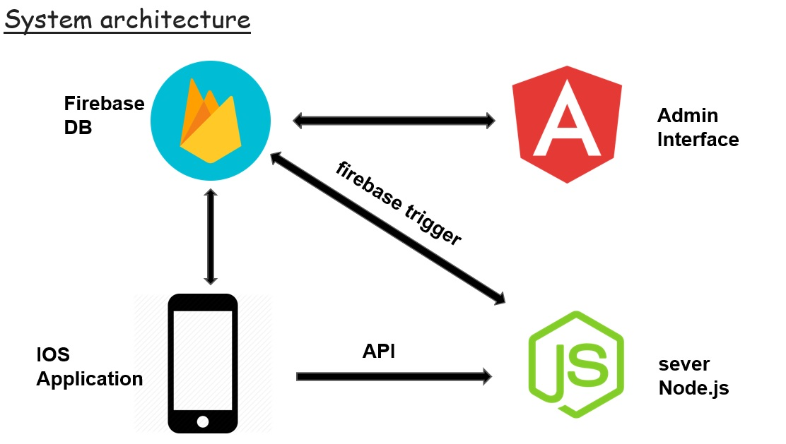

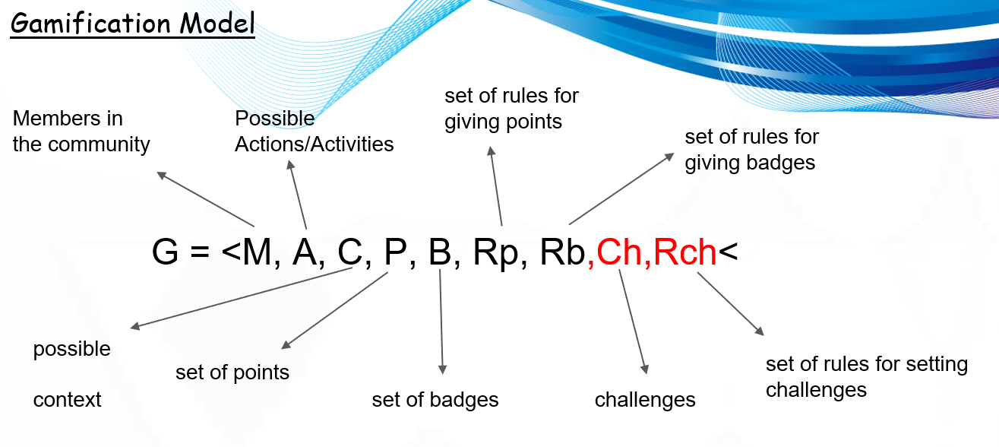

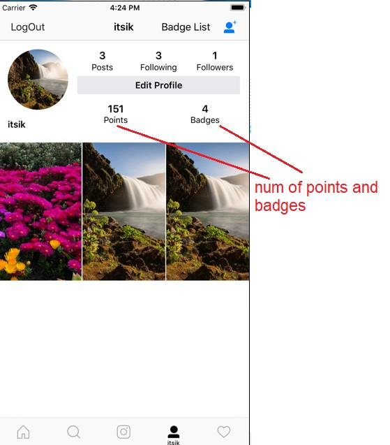

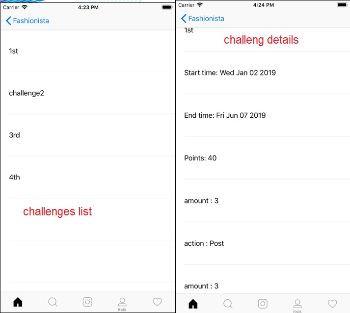

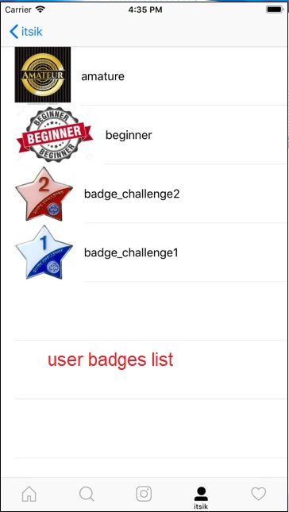

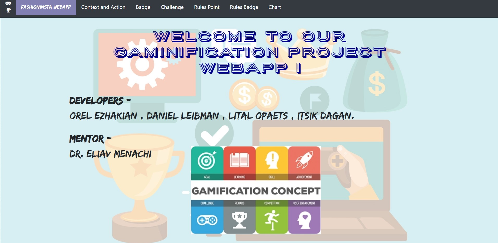

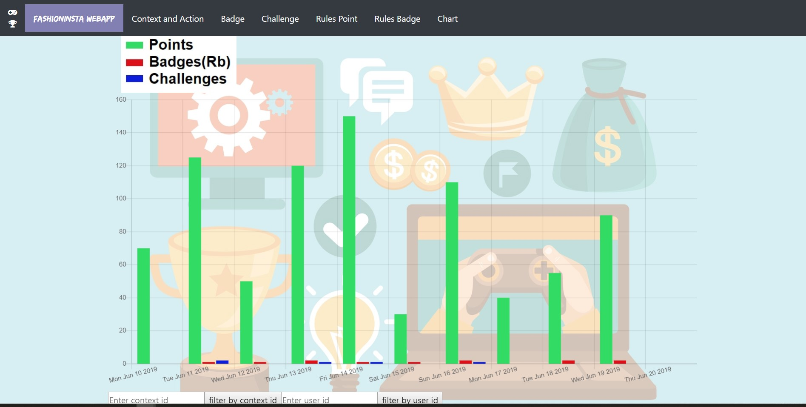

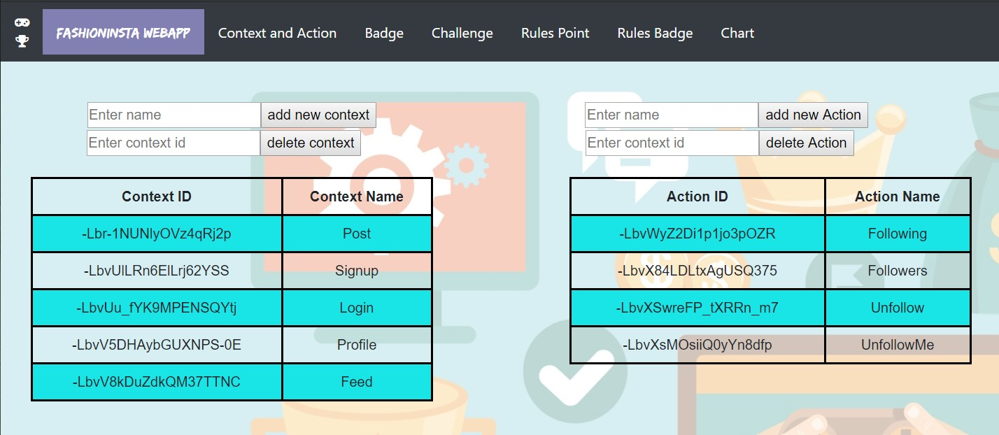

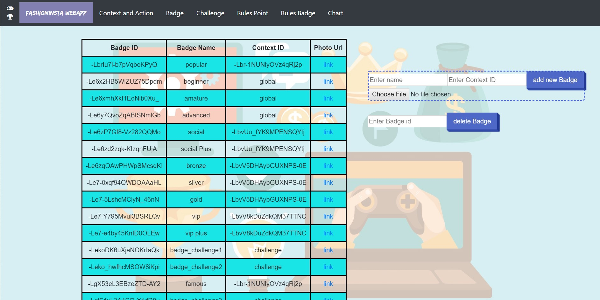

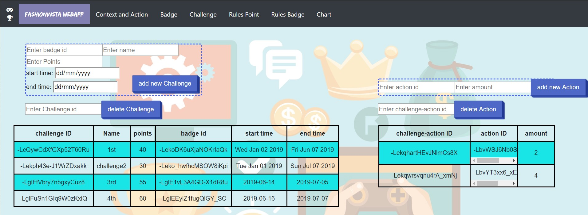

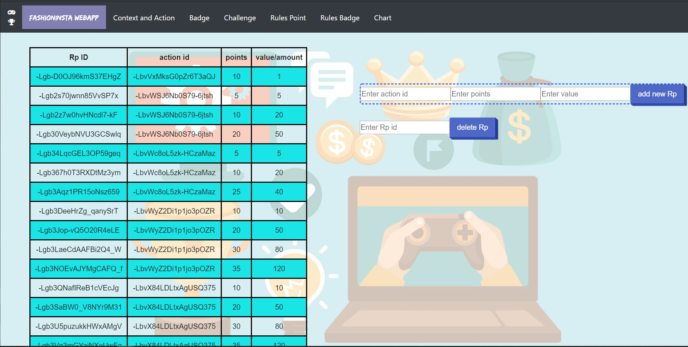

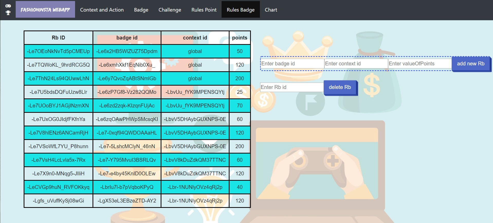

